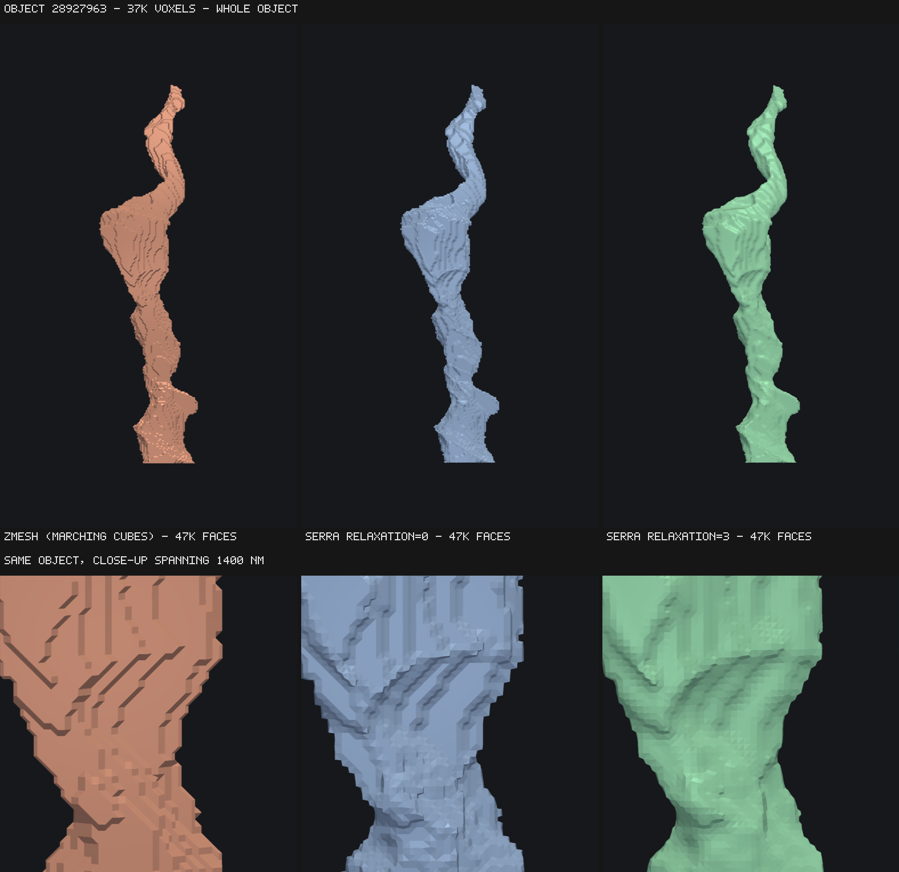
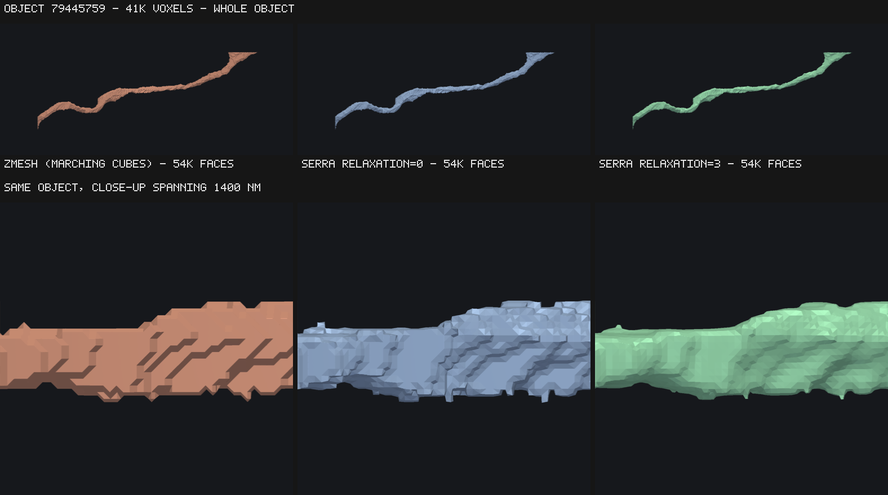
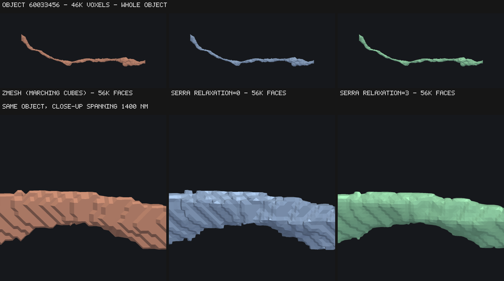
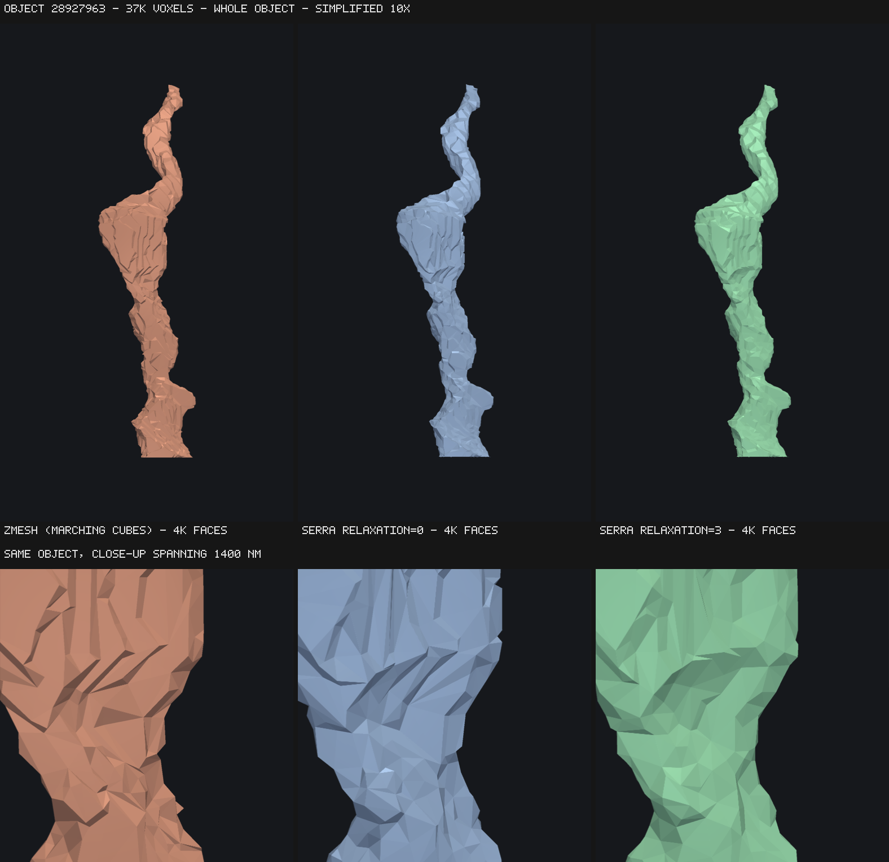
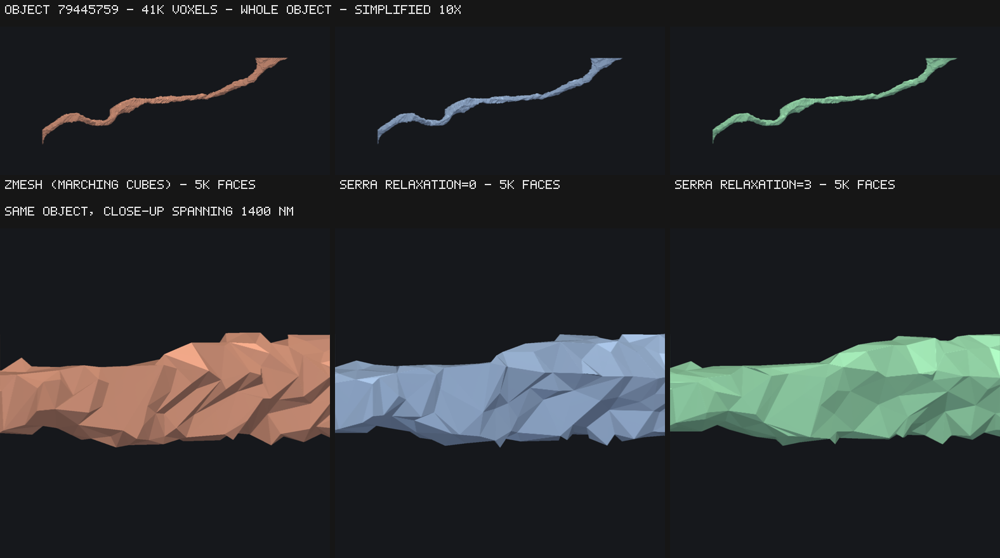
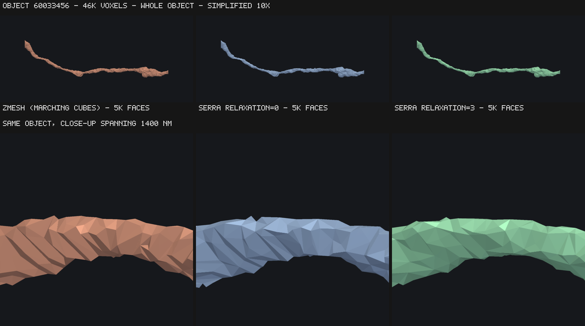
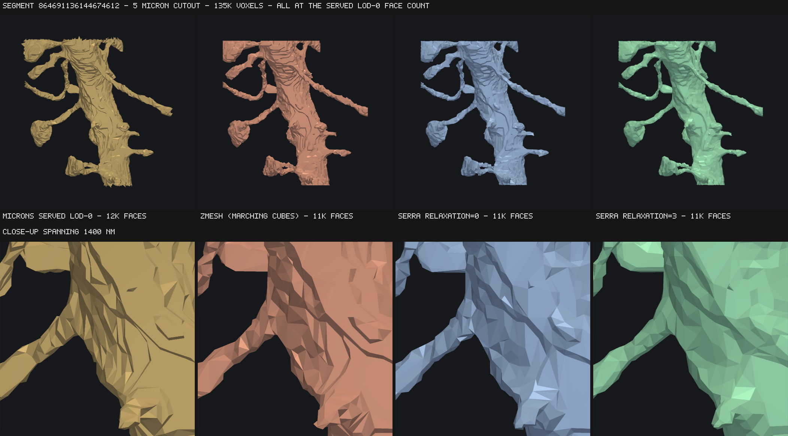

# serra

Analytical multi-material meshes from voxelized segmentations.
It is named after the artist Richard Serra, who is known for making beautiful smooth geometric forms out of rusted metal.

`serra` turns a 3-D array of integer labels into one triangle mesh per label. It is
built for connectomics-scale data, where a single chunk may contain hundreds of
thousands of distinct objects, so it makes **one pass over the volume** regardless of
how many labels are present.

```bash
pip install serra-mesh
```

```python
import serra_mesh

mesher = serra_mesh.Mesher(voxel_resolution=[4, 4, 40])
mesher.mesh(cutout)          # a 3-D array of integer labels
mesh = mesher.get(504)       # mesh.vertices, mesh.faces
```

## What makes it different

serra uses **multi-label surface nets** (dual contouring) rather than marching cubes.
Vertices sit inside cells at a position determined by where the label boundary
crosses the cell, instead of being pinned to voxel-edge midpoints. That removes the
staircase artifact, which shows up most clearly in surface area.

Measured on analytically-known spheres (isotropic voxels), against `zmesh`:

| sphere radius | zmesh area error | serra area error |
| ------------- | ---------------- | ---------------- |
| 10 voxels     | +8.52%           | +2.89%           |
| 20 voxels     | +9.31%           | +2.97%           |
| 40 voxels     | +8.77%           | +2.80%           |

Marching-cubes area error does not shrink as resolution rises — it is a systematic
bias, not a sampling error. With the optional relaxation pass enabled
(`relaxation=3`) serra's area error drops to **+0.38%**, while volume stays within
0.2% of analytic in every case.

Other properties:

- **2-manifold per object.** No non-manifold vertices or edges. Cells where a label
  touches itself only diagonally get their vertex split per connected component.
- **Watertight** inside the volume; open only where an object runs off the edge.
- **Deterministic.** Identical output regardless of thread count, memory order,
  dtype width, or platform — including under relaxation, which uses Jacobi
  iteration so no result depends on visit order.
- **Chunk-seam exact.** Meshed with a 1-voxel halo, vertices on a shared seam are
  bit-identical between neighbouring chunks, so chunks stitch by vertex dedup alone.

## How it looks

Three objects from the 512³ MICrONS test volume, meshed by zmesh and by serra
and rendered from an identical camera with flat shading. Flat shading is
deliberate — it makes individual triangles visible, which is exactly what
distinguishes a staircased surface from a smooth one.

The objects are sampled around the 80th size percentile rather than taken from
the top: the largest object in a cutout is a cell body or a trunk crossing the
whole box, and says little about the surfaces most objects get. The top row of
each figure is the whole object, the bottom row a close-up spanning 1400 nm of
the same surface.

| | |
| --- | --- |
|  | 38K voxels, 47K faces |
|  | 42K voxels, 54K faces |
|  | 47K voxels, 57K faces |

Marching cubes produces axis-aligned terraces because its vertices are pinned to
voxel-edge midpoints. serra's are placed inside each cell from where the label
boundary actually crosses it, so the terracing is gone even before relaxation;
`relaxation=3` removes the remaining faceting. Face counts are within 1% across
all three, so this is not a resolution difference.

The same objects decimated 10× — the regime PyChunkedGraph actually stores, and
the one where the input surface matters most, since a quadric simplifier keeps
whatever the extractor gave it:

| | |
| --- | --- |
|  | 47K → 4.7K faces |
|  | 54K → 5.4K faces |
|  | 57K → 5.7K faces |

### Against the mesh MICrONS publishes

A 5 µm cutout around segment `864691136144674612` at 32×32×40 nm, with both
meshers decimated to the face count of the LOD-0 mesh the dataset actually
serves for that segment — so all four panels are drawn on the same budget:



Regenerate with:

```bash
python bench/render_comparison.py --zmesh ../zmesh --out docs/images
python bench/render_comparison.py --zmesh ../zmesh --out docs/images --simplify 10
python bench/render_segment.py --zmesh ../zmesh --out docs/images
```

## Performance

On the 512³ connectomics volume (2524 objects), Apple M4 Pro (14 cores):

| | serra (1 thread) | serra (14 threads) | zmesh |
| --- | --- | --- | --- |
| `mesh()` — traverse the volume | 1.52 s | **0.29 s** | 1.22 s |
| `get()` — extract all 2524 objects | **0.81 s** | 0.81 s | 23.2 s |
| peak RSS | **2.0 GB** | 2.8 GB | 3.2 GB |
| output | 44.8M vertices / 89.2M faces | same | 45.0M / 89.5M |

zmesh has no threading, so the fair single-threaded comparison is the first
column: it is about 20% faster at traversing the volume there. Traversal scales
to 5.2× on 14 cores, at the cost of about 0.8 GB for the merge. serra is roughly 29× faster
at extraction, which needs explaining because it is an architectural difference
rather than a tuning one.

Marching cubes emits a **triangle soup**: every triangle carries its own three
vertices with no sharing. Turning that into an indexed mesh means deduplicating
them, and zmesh does it per object with a hash map keyed on packed coordinates.
Measured on this volume, that is 268.6M soup vertices collapsing to 45.0M unique
— a 6× redundancy — at 86 ns each, which is simply what a hash-map insertion
costs. The soup is also what drives the memory: 268.6M packed vertices is 2.1 GB
held live while the map is being built.

serra never creates the duplicates. The extractor assigns one vertex per cell
per connected component up front and quads reference those indices directly, so
`get()` is a coordinate conversion and a triangulation — 19 ns per vertex, or
memcpy territory.

Reproduce with:

```bash
python bench/compare_zmesh.py serra
python bench/compare_zmesh.py zmesh
```

### Controlling parallelism

```python
serra_mesh.Mesher(threads=0)   # default: every core
serra_mesh.Mesher(threads=1)   # fully sequential
serra_mesh.Mesher(threads=4)   # exactly four
```

**Set `threads=1` if you are already parallelising at a higher level** — one
chunk per process in a pipeline, say — otherwise every process tries to claim
every core and they fight each other.

Any value above 1 gets a private thread pool, so the setting is honoured
exactly, is not overridden by `RAYON_NUM_THREADS`, and does not disturb other
users of rayon in the same process. Only `threads=0` defers to
`RAYON_NUM_THREADS`. `mesher.effective_threads` reports what will actually be
used.

Scaling on the volume above, and peak memory measured in a fresh process each
time:

| threads | `mesh()` | speedup | peak RSS |
| --- | --- | --- | --- |
| 1 | 1.52 s | 1.0× | 2.0 GB |
| 2 | 0.95 s | 1.6× | |
| 4 | 0.54 s | 2.8× | |
| 8 | 0.33 s | 4.6× | |
| 14 | 0.29 s | 5.2× | 2.8 GB |

**Output is byte-identical at every thread count**, which the test suite checks
directly rather than assuming. The volume is split into bands along one axis; a
band cannot emit its own first cell layer's quads, since those read the layer
below, so a short serial pass produces them afterwards and splices them into
each label's face list in the position a single traversal would have put them.

## Chunked meshing

Each chunk owns a disjoint range of voxels and is passed to `mesh()` with a
**1-voxel halo on every side** — so neighbouring input arrays overlap by 2 voxels.
This is what makes the dual cells along a seam shared between both chunks, and
therefore what makes their vertices identical.

**One voxel of halo is enough at any `relaxation` setting.** Iterative smoothing
normally propagates one cell per iteration, which would mean `k` iterations need
`k + 1` voxels of halo. serra instead holds the outermost layer of cells fixed —
precisely the vertices whose one-ring the chunk does not fully contain — so
relaxation never reads past the halo. A chunk's mesh is therefore reproducible
from that chunk's own array alone, whatever `k` is.

The trade-off is deliberate: a chunk's interior smooths slightly more than the
band around its seams, so a stitched surface is self-consistent and watertight,
but not identical to the same volume meshed in one piece.

## Naming

The distribution is `serra-mesh` and the module is `serra_mesh`, because the
name `serra` on PyPI belongs to an unrelated data-pipelines package that also
ships a top-level `serra` module. Sharing the import name would risk one
install silently overwriting the other, since pip does not detect file
conflicts between distributions. The project itself is still serra.

## Status

Under active development. See `docs/` for the user guide and the developer guide to
the module layout.

## License

MIT
