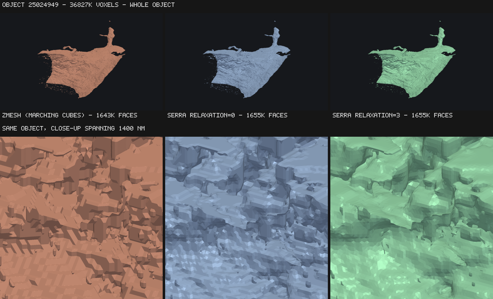
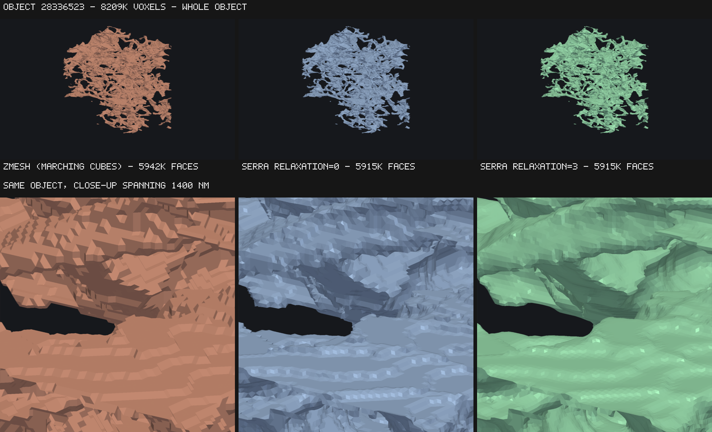
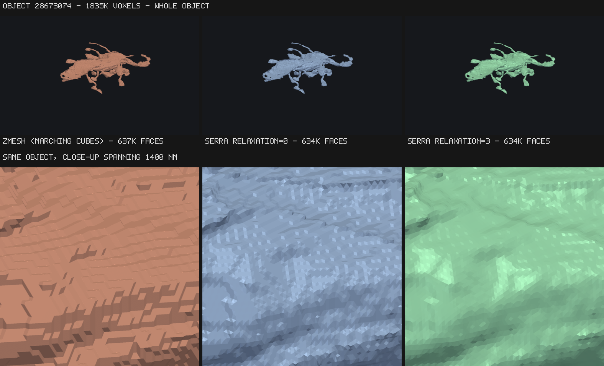

# serra

Analytical multi-material meshes from voxelized segmentations.
It is named after the artist Richard Serra, who is known for making beautiful smooth geometric forms out of rusted metal.

`serra` turns a 3-D array of integer labels into one triangle mesh per label. It is
built for connectomics-scale data, where a single chunk may contain hundreds of
thousands of distinct objects, so it makes **one pass over the volume** regardless of
how many labels are present.

```python
import serra

mesher = serra.Mesher(voxel_resolution=[4, 4, 40])
mesher.mesh(cutout)          # a 3-D array of integer labels
mesh = mesher.get(504)       # mesh.vertices, mesh.faces
```

## What makes it different

serra uses **multi-label surface nets** (dual contouring) rather than marching cubes.
Vertices sit inside cells at a position determined by where the label boundary
crosses the cell, instead of being pinned to voxel-edge midpoints. That removes the
staircase artifact, which shows up most clearly in surface area.

Measured on analytically-known spheres (isotropic voxels), against `zmesh`:

| sphere radius | zmesh area error | serra area error |
| ------------- | ---------------- | ---------------- |
| 10 voxels     | +8.52%           | +2.89%           |
| 20 voxels     | +9.31%           | +2.97%           |
| 40 voxels     | +8.77%           | +2.80%           |

Marching-cubes area error does not shrink as resolution rises — it is a systematic
bias, not a sampling error. With the optional relaxation pass enabled
(`relaxation=3`) serra's area error drops to **+0.38%**, while volume stays within
0.2% of analytic in every case.

Other properties:

- **2-manifold per object.** No non-manifold vertices or edges. Cells where a label
  touches itself only diagonally get their vertex split per connected component.
- **Watertight** inside the volume; open only where an object runs off the edge.
- **Deterministic.** Identical output regardless of thread count, memory order,
  dtype width, or platform — including under relaxation, which uses Jacobi
  iteration so no result depends on visit order.
- **Chunk-seam exact.** Meshed with a 1-voxel halo, vertices on a shared seam are
  bit-identical between neighbouring chunks, so chunks stitch by vertex dedup alone.

## How it looks

The three largest objects in the 512³ connectomics test volume, meshed by zmesh
and by serra, rendered from an identical camera with flat shading. Flat shading
is deliberate — it makes individual triangles visible, which is exactly what
distinguishes a staircased surface from a smooth one.

The top row of each figure is the whole object; the bottom row is a close-up
spanning 1400 nm of the same surface, where the difference is obvious.

| | |
| --- | --- |
|  | 36.8M voxels, ~1.65M faces |
|  | 8.2M voxels, ~5.9M faces |
|  | 1.8M voxels, ~635K faces |

Marching cubes produces axis-aligned terraces because its vertices are pinned to
voxel-edge midpoints. serra's are placed inside each cell from where the label
boundary actually crosses it, so the terracing is gone even before relaxation;
`relaxation=3` removes the remaining faceting. Face counts are within 1% across
all three, so this is not a resolution difference.

Regenerate with:

```bash
python bench/render_comparison.py --zmesh ../zmesh --out docs/images
```

## Performance

On the 512³ connectomics volume (2524 objects), single-threaded, Apple M4 Pro:

| | serra | zmesh |
| --- | --- | --- |
| `mesh()` — traverse the volume | 1.49 s | **1.22 s** |
| `get()` — extract all 2524 objects | **0.81 s** | 23.2 s |
| peak RSS | **2.5 GB** | 4.8 GB |
| output | 44.8M vertices / 89.2M faces | 45.0M / 89.5M |

zmesh is about 20% faster at traversing the volume. serra is roughly 29× faster
at extraction, which needs explaining because it is an architectural difference
rather than a tuning one.

Marching cubes emits a **triangle soup**: every triangle carries its own three
vertices with no sharing. Turning that into an indexed mesh means deduplicating
them, and zmesh does it per object with a hash map keyed on packed coordinates.
Measured on this volume, that is 268.6M soup vertices collapsing to 45.0M unique
— a 6× redundancy — at 86 ns each, which is simply what a hash-map insertion
costs. The soup is also what drives the memory: 268.6M packed vertices is 2.1 GB
held live while the map is being built.

serra never creates the duplicates. The extractor assigns one vertex per cell
per connected component up front and quads reference those indices directly, so
`get()` is a coordinate conversion and a triangulation — 19 ns per vertex, or
memcpy territory.

Reproduce with:

```bash
python bench/compare_zmesh.py serra
python bench/compare_zmesh.py zmesh
```

## Chunked meshing

Each chunk owns a disjoint range of voxels and is passed to `mesh()` with a
**1-voxel halo on every side** — so neighbouring input arrays overlap by 2 voxels.
This is what makes the dual cells along a seam shared between both chunks, and
therefore what makes their vertices identical.

**One voxel of halo is enough at any `relaxation` setting.** Iterative smoothing
normally propagates one cell per iteration, which would mean `k` iterations need
`k + 1` voxels of halo. serra instead holds the outermost layer of cells fixed —
precisely the vertices whose one-ring the chunk does not fully contain — so
relaxation never reads past the halo. A chunk's mesh is therefore reproducible
from that chunk's own array alone, whatever `k` is.

The trade-off is deliberate: a chunk's interior smooths slightly more than the
band around its seams, so a stitched surface is self-consistent and watertight,
but not identical to the same volume meshed in one piece.

## Status

Under active development. See `docs/` for the user guide and the developer guide to
the module layout.

## License

MIT
