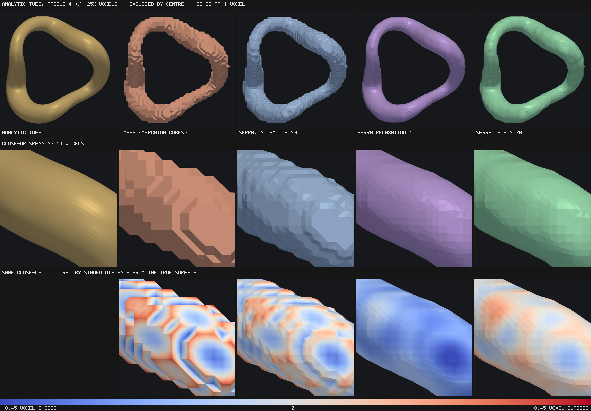
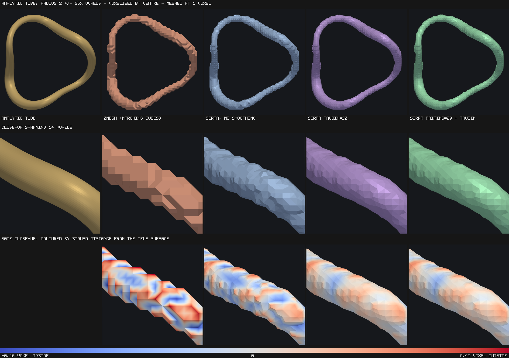

# Accuracy and smoothing

How close serra's surface is to the truth, and what the smoothing options do.

The structural properties below — closed, 2-manifold, correctly oriented, the
right Euler characteristic, no vertex past its bound, seams bit-identical
between chunks — are enforced by the test suite. The figures come from the
benchmark named in each section.

## What you are choosing between

Smoothing is off by default. When you turn it on there are exactly **two
independent choices**, and the named parameters are the four cells of that grid:

| | Laplacian step | Taubin step pair |
| --- | --- | --- |
| **per label** | `relaxation=k` | `taubin=k` |
| **per cell** | `fairing=k` | **`fairing=k` + `fairing_taubin=True`** |

The **domain** decides whether objects that touch each other stay a partition of
space. The **filter** decides whether volume survives. They are orthogonal
problems and each is solved by one axis of the grid, which is why the
recommendation is the corner that solves both.

All four run inside `mesh()`, so a mesh is always smoothed *before* `get()`
simplifies it — the order that measures better. All four obey `max_deviation`.
All four pin the outermost layer of cells, so chunked meshing still stitches by
exact vertex equality. The three entry parameters (`relaxation`, `taubin`,
`fairing`) are mutually exclusive; `fairing_taubin` is a modifier on `fairing`.

### The domain: who owns a shared wall

In dense neuropil **88.6% of distinct vertex positions belong to more than one
label**. Most surface is interface, not exterior boundary.

**Per label** (`relaxation`, `taubin`) fairs each object's own mesh. Two objects
sharing a wall hold two separate copies of it and each is smoothed independantly.
Because of this, each copy can drift apart, by up to **2.2 voxels (71 nm)** on
real neuropil. Each object stays individually watertight and manifold, but the
meshes no longer reflect a perfect partitioning of space like the voxels
they were derived from.

**Per cell** (`fairing`) smooths one position per cell, shared by every label
present there. The two copies of a wall are then the same number and cannot
disagree, at any iteration count. It is also *less* destructive at matched
operator and iteration count — 93.9% of true volume against 84.0% — because a
shared node is pulled by neighbours drawn from every label meeting there, and
those neighbours agree with one another.

`fairing_junction_rule` (on by default) restricts cells where three or more
labels meet to their junction neighbours, so those vertices slide *along* the
junction curve instead of being pulled off it by the ordinary walls that also
meet there.

### The filter: whether volume survives

**Laplacian** (`relaxation`, or `fairing` alone) moves each vertex a fraction of
the way to its neighbours' average. It is diffusion, and diffusion shrinks. It
is strikingly efficient at buying normal accuracy — 3 passes reach what Taubin
needs 20 for — but it removes a roughly fixed *depth* from every surface, so the
relative cost scales as **1/r**. That is fine for a cell body and ruinous for
thin objects, such as a spine neck.

**Taubin** (`taubin`, or `fairing_taubin=True`) alternates a positive step
`lambda` with a larger negative one, `mu`, derived from the pass band. The pair
is a low-pass filter rather than a diffusion: the low graph frequencies carrying
an object's bulk come through at close to unit gain, so the surface can be
smoothed hard without the volume draining away. It costs two passes per
iteration instead of one.

### `max_deviation`: the bound on all four

`max_deviation` (in voxels, default 0.5) caps how far any vertex may move from
where local placement put it — per axis, against the *original* position rather
than per step. Tightening it monotonically reduces shrinkage: on a radius-20
sphere at `relaxation=25`, volume error goes −6.42% → −2.99% → −1.09% as it
tightens 0.5 → 0.25 → 0.1.

It is a safety rail, not a substitute for choosing the right filter. It bounds
how far the surface can stray from the data; it does not remove the Laplacian's
systematic inward bias, it only clips it.

### The recommendation

**`fairing=20, fairing_taubin=True`.** Cell domain so touching objects cannot
drift, Taubin so thin processes keep their volume.

- Use `taubin=k` instead if every object is isolated — same result, slightly
  less bookkeeping.
- Reach for a plain Laplacian only when nothing about the mesh will be measured
  and the iteration budget is tight.

### What smoothing is not

It is not super-resolution. Smoothing the mesh of a downsampled segmentation
does **not** recover the boundary that downsampling discarded — measured in
[When the voxels are not the truth](#when-the-voxels-are-not-the-truth). Its job
is to remove the staircase the dual grid introduces, and that is all.

Nor does it change topology: genus survives and one-voxel-thick sheets do not
collapse, in any cell of the grid, at any iteration count.

## Accuracy before any smoothing

Measured against exact volume and area, isotropic voxels, no smoothing:

| shape | volume | area | mean normal error |
| --- | --- | --- | --- |
| sphere, r = 8…32 | < 0.11% | +2.8 - 3.0% | 8.1° |
| ellipsoid 30/20/12 | +0.17% | +3.3% | 8.6° |
| cylinder, any axis | −1.48% | −0.47% | |
| torus R25 r8 | +0.24% | +2.9% | |
| ellipsoid on 4×4×40 nm voxels | −0.21% | | |

 **Area is overstated by about 3%** on smooth surfaces
and does not shrink with resolution, because placing a cell's vertex at the
centroid of its edge crossings leaves the surface slightly faceted; marching
cubes has the same non-convergence at roughly +9%. 

### Agreement with zmesh on real data

In order to validate that the meshing code here produces similar meshes to 
a widely used meshing algorithm. We ran tests (`bench/validate_winding.py`) 
to classifies sample points as inside or outside meshes  with a robust
generalized winding number. Running the same points on two meshing routines
allow us to measure how much the two meshers disagree. 

If the meshes are similar, most points will agree and therefore 
the volume estimate will be similar.  Further, the points which 
do not agree will lie very near the surface of the mesh. 

Significant disagreements should produce many points which do not agree
and therefore produce different volume estimates, and the points of
disagreement will be far from the mesh boundary. 

We tested on a fixture of a 512³ cutout of dense MICrONS neuropil at 
32×32×40 nm holding **20,840 objects with a median size of 56 voxels**,
We chose 24 objects that spanned the range of sizes, 
and sampled 20,000 points from each object.

| | value |
| --- | --- |
| serra volume / true voxel volume | **0.982** (0.918–1.005) |
| zmesh volume / true voxel volume | 0.968 (0.918–0.991) |
| winding-number agreement | 94.7% of sampled points |
| disagreeing points, distance to surface | median **0.47** vx, worst **2.11** |
| all sampled points, distance to surface | median 4.98 vx |

serra sits closer to the voxel truth than zmesh, but largely agrees on sampled
points.  Every disagreement is a boundary effect, with the farthest disagreeing
point found 2 voxels from a surface, with a median of less than half a voxel.
Remember, most objects are thin so the 94.7% raw rate includes many points
which are very near a surface. 

## Evidence: smoothing improves the surface

### Judged against an analytic solid

A different way of measuring accuracy is to start with a known object where
you can analytically derive whether a point should be inside or outside the
object. `bench/analytic_tube.py` creates a tube defined by a smooth closed
space curve and a radius. The curve winds around the z axis while oscillating
along it, presenting every orientation to the grid. This can be queried
exactly at any floating-point coordinate. It uses this to classify voxels on
a grid as in or out to produce input for meshing, but then can also measure
any floating point mesh vertex to see how far from the true surface it is.
Error is the analytic signed distance at area-weighted sample points on the
mesh: a perfect mesh scores zero, and the signed mean says which side it
sits on.



This is the most favourable setting for smoothing that exists — the true surface
really is smooth, so everything separating it from the voxelisation is
quantisation noise and there is no real detail to destroy.

| radius 4 voxels | mean \|error\| | bias | volume | IoU |
| --- | --- | --- | --- | --- |
| zmesh (marching cubes) | 0.141 vx | −0.021 | −1.18% | 93.48% |
| serra, no smoothing | 0.109 vx | −0.043 | −2.15% | 94.99% |
| `taubin=20` | 0.068 vx | −0.009 | −0.40% | 96.85% |
| **`fairing=20 + taubin`** | **0.068 vx** | **−0.010** | **−0.42%** | **96.85%** |
| `fairing=40 + taubin` | 0.063 vx | +0.021 | +1.08% | 96.98% |

Every row carries 13,504 faces: smoothing moves vertices and never changes
topology, so this compares placements of one mesh.

**Smoothing recovers the surface the grid hid.** Mean error falls 38% and the
bias converges on zero — at 20 sweeps the surface is unbiased to within a
hundredth of a voxel and the enclosed volume is within half a percent of
analytic. serra beats marching cubes at every radius, by 10–25% in mean surface
error, with the largest gap on the thinnest tube.

**The two domains agree to three decimal places**, which is why this fixture is
run here. A tube is a single object, and on a single object the cell and label
domains are the same graph — anything but agreement would mean the cell-domain
implementation was wrong. What the cell domain *buys* a one-object fixture
structurally cannot show; that is the neuropil measurement
[below](#evidence-the-domain-choice-is-not-cosmetic).

### Thin structures decide it

The same experiment at three radii — mean surface error in voxels, then IoU:

| | r=2 | r=4 | r=8 | | r=2 | r=4 | r=8 |
| --- | --- | --- | --- | --- | --- | --- | --- |
| zmesh | 0.145 | 0.141 | 0.147 | | 86.8% | 93.5% | 96.7% |
| no smoothing | 0.127 | 0.109 | 0.107 | | 87.9% | 95.0% | 97.6% |
| `relaxation=3` | 0.217 | 0.123 | 0.087 | | | | |
| `taubin=20` | 0.087 | 0.068 | 0.067 | | 91.9% | 96.8% | 98.5% |
| `fairing=20 + taubin` | 0.087 | 0.068 | 0.068 | | 91.9% | 96.9% | 98.5% |
| **`fairing=40 + taubin`** | **0.079** | **0.063** | **0.063** | | **92.6%** | **97.0%** | **98.5%** |



Read down the radius columns rather than across the rows. Every method improves
as the tube thickens, but not at the same rate: at radius 8 even plain
`relaxation=3` is respectable at 0.087 voxels, while at radius 2 it is *worse
than not smoothing at all* and `relaxation=10` — 0.475 / 0.264 / 0.156 — removes
41% of the volume, dropping IoU to **59.1%**. This is the 1/r term, and it is
worst exactly where
connectomics lives. Taubin's shrink compensation removes that term, which is why
its advantage grows in the same direction the Laplacian's damage does.

### On real neuropil

We can compare the volume of an object measured by counting voxels versus the
volume of a mesh after smoothing to assess it's shrinkage.  
This is potentially more impactful on real data than on geometric forms. 
A sphere has almost no surface to lose; a 200 nm spine neck does. 
So we measured the effects of smoothing on the volume and areas on 24 objects
between the 70th and 99th size percentile in the MICrONS cutout.

| | volume / true | area / unsmoothed |
| --- | --- | --- |
| no smoothing | 99.98% | 100.0% |
| `relaxation=3` | 97.51% | 89.4% |
| `relaxation=10` | 93.06% | 83.2% |
| `taubin=3` | **100.12%** | 95.5% |
| `taubin=10` | **100.44%** | 93.0% |
| `taubin=20` | **100.93%** | 92.2% |

Laplacian relaxation eats 2.5% of the volume at `k=3` and 7% at `k=10`. Taubin
holds it while removing a comparable amount of surface area. 

The same holds visually, on a 5 µm cutout of dendrite `864691136144674612` at
32×32×40 nm, flat shaded so individual triangles stay visible. 


We also added a comparison to VTK's Nuttall
window — added specifically to stop the shrinkage — is indistinguishable from the built-in filter at matched passes,
both by eye and by the numbers (93.8% of original area and 9.8° mean dihedral
against 93.9% and 9.9°). 

## Evidence: the domain choice is not cosmetic

Measured on a 128³ neuropil subvolume with one shared Jacobi operator, six
iterations, `max_deviation = 0.5` — so the operator and the iteration count are
held fixed and the domain is the only variable:

| | area / raw | volume / voxel truth | wall drift, median | max |
| --- | --- | --- | --- | --- |
| no smoothing | 100.0% | 97.99% | 0 | 0 |
| per label | 84.3% | 84.00% | 0.103 vx | **2.224 vx** |
| cell domain | 93.4% | 93.92% | **0** | **0** |
| **cell domain + Taubin** | 97.3% | 97.12% | **0** | **0** |

Two labels' copies of the same wall end up as much as 2.2 voxels — 71 nm —
apart under per-label smoothing. Exactly zero in the cell domain, at any
iteration count, because there is only one number to begin with.

The volume column carries the second point: at identical operator and iteration
count the cell domain is also markedly less destructive, 93.9% against 84.0%.
Adding Taubin recovers the rest. The two axes compose, which is the whole
argument for the recommended corner of the grid.

## Evidence: it is cheap, and belongs before simplification

512³ MICrONS volume, 2523 objects, Apple M4 Pro (14 cores), median of three
runs. `get()` covers extracting every object.

| | `mesh()` | `get()` | total | 1 thread |
| --- | --- | --- | --- | --- |
| no smoothing | 0.28 s | 0.98 s | **1.26 s** | 1.62 s |
| `relaxation=3` | 0.48 s | 0.92 s | 1.40 s | 3.21 s |
| `taubin=2` | 0.51 s | 0.94 s | 1.45 s | 3.49 s |
| `taubin=5` | 0.68 s | 0.96 s | 1.64 s | 4.88 s |

Smoothing is added work and cannot be free.  `taubin=2` costs
about what `relaxation=3` does. Cost splits about evenly between building the
vertex adjacency — once per object, whatever the iteration count — and the
passes themselves, so the *first* iteration is more expensive than the
tenth.

**Smooth first.** At a 10× reduction, with VTK quadric decimation on both paths
so the order is the only variable:

| order | mean distance to full-res | worst | volume kept | roughness |
| --- | --- | --- | --- | --- |
| simplify only | 0.100 vx | 0.70 | 97.8% | 33.6° |
| Taubin then simplify | 0.103 vx | 0.48 | 98.2% | 26.3° |
| simplify then Taubin | 0.325 vx | 2.71 | 88.6% | 22.8° |

Smoothing first costs essentially nothing in fidelity and improves the worst
case; smoothing afterwards deviates 3× further and loses 11% of the volume,
because a decimated mesh has no high-frequency detail left to remove and the
filter eats structure instead. serra gets this order for free — smoothing
happens in `mesh()`, simplification in `get()`.

## Smoothing a chunked volume

All four settings pin the outermost layer of cells, so seam vertices stay
bit-identical between neighbouring chunks and stitching by exact vertex equality
still works. This is *not* true of a post-hoc smoother applied to the output.

The trade-off serra accepts by pinning: a chunk's interior smooths slightly more
than the band around its seams, so a stitched surface is self-consistent and
watertight but not identical to the same volume smoothed in one piece. Sphere of
radius 60 in a 144³ volume at `taubin=10`, positive-only halo of 2:

| chunk | chunks | pinned | stitches | faces = whole-volume | median | worst |
| --- | --- | --- | --- | --- | --- | --- |
| 16³ | 296 | 12.2% | yes | yes | 0.004 vx | 0.171 vx |
| 36³ | 57 | 5.4% | yes | yes | 0.000 vx | 0.174 vx |
| 72³ | 8 | 2.1% | yes | yes | 0.000 vx | 0.129 vx |


## Effects of meshing on downsampled voxels

Every number above treats the array being meshed as ground truth. In a
connectomics pipeline it usually is not. MICrONS is segmented at 8×8×40 nm and
meshed at 32×32×40 for speed and memory, so serra sees a 4×4×1 **downsample** of
a segmentation that already locates the boundary four times more precisely in x
and y.

That raises a fair question about everything above: against the coarse voxels,
Laplacian smoothing "loses volume" and looks like damage — but against the fine
segmentation the coarse array was made from, might the same displacement be
*recovering* the boundary that downsampling discarded?

It does not. `bench/resolution_fidelity.py` fetches both resolutions of the same
box — segment `864691136144674612`, a 5 µm cube, 135,555 coarse voxels against
2,172,904 fine ones — and scores every row on the same million sample points.
The coarse array agrees with a majority downsample of the fine one on 99.74% of
voxels, so this measures serra and not the downsampler.

| mesh | faces | volume vs fine | IoU |
| --- | --- | --- | --- |
| no smoothing | 99,128 | −0.95% | 94.073% |
| `relaxation=10` | 99,128 | −3.96% | **92.860%** |
| `taubin=20` | 99,128 | −0.50% | 94.105% |
| **coarse topology, fine placement** | 99,128 | −0.66% | **98.341%** |
| fine mesh, decimated 9× | 101,560 | −0.21% | 99.926% |
| fine mesh (the ceiling) | 914,048 | −0.16% | 100% |

**Smoothing does not recover the fine boundary.** Taubin is neutral — 0.03
points of a 5.93-point gap, inside the sampling noise. Laplacian relaxation is
actively worse: mean distance to the fine surface rises from 8.2 nm to 10.3 nm
at `relaxation=10`, because it shrinks *past* the true surface rather than
converging on it. So the volume loss reported elsewhere on this page is real
error, not a correction.

**Nor is the triangle budget what costs you** — the fine mesh decimated to the
coarse face count still reaches 99.93%, so the whole deficit is the 32 nm
sampling. What works is placing the coarse vertices from fine data: keeping the
coarse topology exactly and moving each vertex onto the fine surface, clamped to
its own cell as serra's placement already guarantees, recovers **4.27 of the
5.93 points** and drops mean distance to 0.1 nm. That is a prototype rather than
a feature — it projects onto a mesh built from the whole fine array, so it shows
the *value* of fine-resolution placement and not a cheap way to get it, and it
is measured on one segment.

## Reproducing

```bash
uv sync --group bench

python bench/download_microns.py       # re-fetch the neuropil cutout
python bench/validate_winding.py       # serra against zmesh
python bench/analytic_tube.py --render # analytic solid, all radii, figures
python bench/cell_smoothing.py         # the domain comparison
python bench/taubin.py                 # filters, cost, order, chunking
python bench/resolution_fidelity.py    # coarse against fine
```
