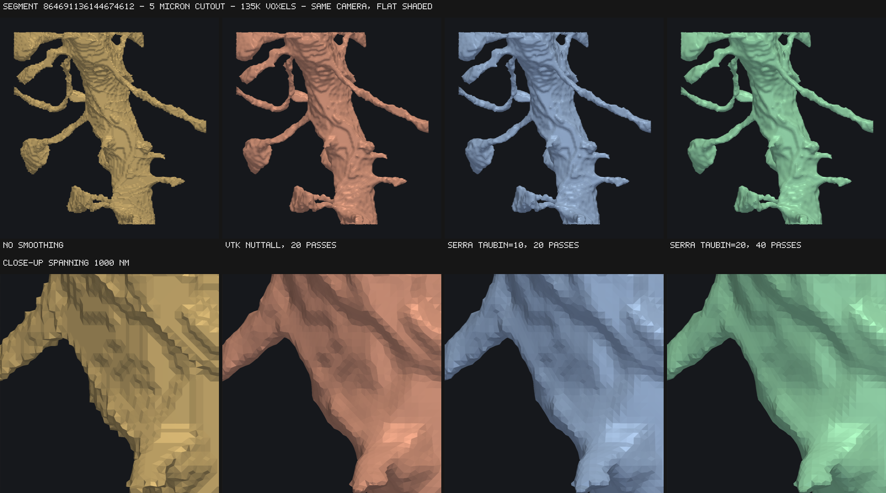

# Accuracy and smoothing

Every figure here is checked by the test suite, and the tolerances there are set
from these measurements rather than from round numbers.

## Analytic shapes

Measured against exact volume and area, isotropic voxels, no relaxation:

| shape | volume | area | mean normal error |
| --- | --- | --- | --- |
| sphere, r = 8…32 | < 0.11% | +2.8…3.0% | 8.1° |
| ellipsoid 30/20/12 | +0.17% | +3.3% | 8.6° |
| cylinder, any axis | −1.48% | −0.47% | |
| torus R25 r8 | +0.24% | +2.9% | |
| ellipsoid on 4×4×40 nm voxels | −0.21% | | |

Every one comes out closed, 2-manifold and correctly oriented, with the right
Euler characteristic — including χ = 0 for the torus, so genus survives meshing.

## Two systematic biases

**Area is overstated by about 3%** on smooth surfaces and does not shrink with
resolution. Placing a cell's vertex at the centroid of its edge crossings leaves
the surface slightly faceted. Marching cubes has the same non-convergence at
roughly +9%.

**Sharp convex edges are bevelled.** An n³ box loses exactly `3n − 2` of volume:
an edge effect, so the relative error falls as 1/n². Marching cubes has the
opposite bias — exact on axis-aligned boxes, 9% over on spheres. For the rounded
shapes serra targets this does not bite; a sphere lands within 0.06%.

## Relaxation

`relaxation=k` runs `k` iterations of constrained smoothing. On a sphere of
radius 20:

| k | volume | area | mean normal | 95th pct | triangle-area CV |
| --- | --- | --- | --- | --- | --- |
| 0 | −0.11% | +2.95% | 8.1° | 17.5° | 0.247 |
| 3 | −0.52% | **+0.24%** | 4.0° | 9.3° | 0.224 |
| 5 | −0.78% | −0.25% | 2.9° | 6.8° | 0.220 |
| 10 | −1.43% | −0.87% | 1.8° | 4.2° | 0.216 |
| 25 | −3.39% | −2.24% | **1.0°** | 2.0° | 0.212 |

Normal accuracy converges with iterations, which it does not under local
placement alone. `k = 3` is a good default when you want it: area error drops
by an order of magnitude for a modest cost.

### Bounding the deviation

Laplacian smoothing shrinks volume. `max_deviation` (in voxels, default 0.5)
caps how far any vertex may move from where the data put it, enforced per axis
against the *original* position rather than per step. Tightening it monotonically
reduces shrinkage:

| max_deviation | volume error at k = 25 |
| --- | --- |
| 0.1 | −1.09% |
| 0.25 | −2.99% |
| 0.5 | −6.42% |

Relaxation preserves topology: genus survives, and one-voxel-thick sheets do not
collapse.

!!! warning "Objects that touch each other"
    Relaxation currently runs per object. Two objects sharing a wall hold
    separate copies of it and smooth against different neighbourhoods near the
    wall's rim, so the wall may no longer be exactly coincident from both sides.
    Each object stays individually watertight and manifold. At `relaxation=0`
    shared walls are exactly coincident, which the test suite checks.


## Validation against zmesh on real data

`bench/validate_winding.py` performs the check described in `CLAUDE.md`: classify
sample points as inside or outside each mesh with a robust generalized winding
number, confirm the volumes agree, and confirm that where the two disagree the
points lie *close to the surface*. That last part is what distinguishes a
genuine difference in where the surface was placed from an actual defect — a
hole or an inverted patch produces disagreements scattered through the volume.

The fixture is `data/microns_neuropil.npy.gz`: a 512³ cutout at 32×32×40 nm from
`gs://iarpa_microns/minnie/minnie65/seg_m1300`, taken from dense neuropil near
the centre of the imaged column. It holds **20,840 objects with a median size of
56 voxels**, and no single object exceeds 4.1% of the volume — deliberately not a
cell body, since serra is built for volumes with very many small objects.

Over 24 objects spanning the size range, 20,000 sample points each:

| | value |
| --- | --- |
| serra volume / true voxel volume | **0.982** (0.918–1.005) |
| zmesh volume / true voxel volume | 0.968 (0.918–0.991) |
| serra / zmesh volume | **1.015** (1.000–1.031) |
| winding-number agreement | 94.7% of sampled points |
| disagreeing points, distance to surface | median **0.47** voxels, worst **2.11** |
| all sampled points, distance to surface | median 4.98 voxels |

Two things to read from this.

**serra is closer to the voxel truth than zmesh** — 0.982 against 0.968 — and
both undershoot, which is expected: a surface drawn through the voxel boundary
cuts the corners off a blocky object.

**Every disagreement is a boundary effect.** Disagreeing points sit 11× closer to
the surface than a typical sampled point, and none is further than 2.11 voxels
from it. The two meshers place the surface slightly differently within about a
voxel, and agree everywhere else. Nothing is scattered through the interior,
which is what a hole or an inverted normal would produce.

The raw agreement rate of 94.7% is not a defect either: most of these objects are
tiny, so uniform sampling in their bounding box puts a large share of points
within a voxel of the surface. Agreement is 99%+ on the larger objects and falls
on the smallest purely through the surface-to-volume ratio.

### Reproducing

```bash
uv sync --group bench
python bench/download_microns.py            # re-fetch the cutout
python bench/download_microns.py --survey   # re-run the region search
python bench/validate_winding.py
```

## When the voxels are not the truth

Every number above treats the array being meshed as ground truth. In a
connectomics pipeline it usually is not. MICrONS is segmented at 8×8×40 nm and
meshed at 32×32×40 for speed and memory, so serra sees a 4×4×1 **downsample** of
a segmentation that already locates the boundary four times more precisely in x
and y.

That changes what smoothing is for. Against the coarse voxels, relaxation "loses
volume" and looks like damage. Against the fine segmentation the coarse array
was made from, the same displacement might instead be *recovering* the boundary
that downsampling discarded. `bench/resolution_fidelity.py` settles it by
fetching both resolutions of the same box.

Segment `864691136144674612`, a 5 µm cube: 135,555 coarse voxels against
2,172,904 fine ones. The served coarse array agrees with a majority downsample of
the fine one on 99.74% of voxels, so this is measuring serra and not the
downsampler. Agreement is scored by sampling a million points, asking the fine
segmentation whether each is inside, and asking the coarse mesh the same with a
winding number — every row scored on identical points, since the differences are
fractions of a percent.

| mesh | faces | volume vs fine | IoU | too big | too small |
| --- | --- | --- | --- | --- | --- |
| no smoothing | 99,128 | −0.95% | 94.073% | 2.70% | 3.39% |
| `relaxation=1` | 99,128 | −1.29% | 94.040% | 2.58% | 3.53% |
| `relaxation=3` | 99,128 | −1.95% | 93.885% | 2.37% | 3.89% |
| `relaxation=10` | 99,128 | −3.96% | **92.860%** | 1.89% | 5.39% |
| `taubin=3` | 99,128 | −0.88% | 94.085% | 2.73% | 3.35% |
| `taubin=20` | 99,128 | −0.50% | 94.105% | 2.85% | 3.21% |
| **coarse topology, fine placement** | 99,128 | −0.66% | **98.341%** | 0.58% | 1.09% |
| fine mesh, decimated 9× | 101,560 | −0.21% | 99.926% | 0.02% | 0.05% |
| fine mesh (the ceiling) | 914,048 | −0.16% | 100% | — | — |

**Smoothing does not recover the fine boundary.** Taubin is neutral — 0.03
points of a 5.93-point gap, inside the sampling noise. Laplacian relaxation is
actively worse, and the mechanism is visible in the last two columns: it trades
a small reduction in over-inclusion for a larger increase in under-inclusion. It
is shrinking past the true surface, not converging on it. Mean distance to the
fine surface goes the same way, 8.2 nm unsmoothed to 10.3 nm at
`relaxation=10`. So the volume loss reported elsewhere on this page is real
error, not a correction.

**The triangle budget is not what costs you.** The fine mesh decimated to the
same face count as the coarse one reaches 99.93%. All of the 5.9-point deficit
is the 32 nm sampling; none of it is the mesh being too coarse to represent the
shape.

**What does work is placing the coarse vertices from fine data.** Keeping the
coarse topology exactly — same connectivity, same 99,128 faces, same mesh memory
— and moving each vertex onto the fine surface, clamped to its own cell as
serra's placement already guarantees, recovers **4.27 of the 5.93 points**, 72%
of the gap. Mean distance to the fine surface falls from 8.2 nm to 0.1 nm.

!!! note "What this prototype does and does not show"

    It projects onto a fine mesh built from the whole fine array, so it
    demonstrates the *value* of fine-resolution placement, not a cheap way to
    get it. A real implementation would read the fine array a slab at a time and
    compute each coarse cell's vertex from the fine occupancy inside it —
    `cell_vertex` is already a per-cell function of the corner labels, so the
    change is confined to placement and leaves topology, seams and chunking
    alone. Peak memory would be one fine slab rather than one coarse slab, not
    the whole fine volume.

    Measured on one segment. It should be repeated across object sizes and on a
    cell body before anything is built on it.

## Two smoothing filters

`relaxation=k` is Frisken's constrained Laplacian fairing: each pass moves a
vertex a fraction of the way to the average of its neighbours, bounded by
`max_deviation`, with seam vertices pinned. It is diffusion, and diffusion
shrinks.

`taubin=k` alternates a positive step `lambda` with a larger negative one, `mu`,
derived from `taubin_pass_band`. The pair is a low-pass filter rather than a
diffusion: the low graph frequencies that carry an object's bulk come through at
close to unit gain, so the surface can be smoothed hard without the volume
draining away. Each iteration costs two passes instead of one. Everything else
is shared — the same adjacency, the same pinning, the same `max_deviation`
bound.

Both run inside `mesh()`, so a mesh is always smoothed **before** `get()`
simplifies it, which is the order that measures better (see below).

### On an analytic sphere

Radius 32 voxels, isotropic. Normal error is the mean angle between each face
normal and the true surface normal.

| | area error | volume error | normal error |
| --- | --- | --- | --- |
| no smoothing | +2.80% | −0.23% | 12.52° |
| `relaxation=3` | +0.28% | −0.39% | 5.16° |
| `relaxation=10` | −0.42% | −0.75% | 1.76° |
| `relaxation=20` | −0.82% | −1.27% | 0.97° |
| `taubin=3` | +1.29% | −0.22% | 8.57° |
| `taubin=10` | +0.47% | −0.19% | 5.19° |
| `taubin=20` | +0.25% | −0.14% | 3.80° |
| `taubin=40` | +0.19% | −0.05% | 2.94° |

Read the columns together. Relaxation is far more efficient at buying normals —
3 passes reach what Taubin needs 20 for — but it pays in volume, and past
`relaxation=10` the area error has gone *negative*: the sphere is now smaller
than the data says. Taubin's volume error moves the other way, towards zero.

### What it looks like

A 5 µm cutout of dendrite `864691136144674612` at 32×32×40 nm, one camera, flat
shaded so individual triangles stay visible. VTK's Nuttall window is included at
a matched pass count — one VTK iteration is one pass, one serra iteration is two
— since Nuttall is the window VTK added specifically to stop the shrinkage the
older Hamming window causes.



| | area / unsmoothed | mean dihedral |
| --- | --- | --- |
| no smoothing | 100.0% | 17.9° |
| vtk nuttall, 20 passes | 93.8% | 9.8° |
| `serra taubin=10`, 20 passes | 93.9% | 9.9° |
| `serra taubin=20`, 40 passes | 93.2% | 8.5° |

At equal passes the built-in filter and Nuttall are indistinguishable, by the
numbers and by eye. The difference is that the built-in one can be run per chunk.

### On real neuropil, which is what settles it

A sphere has almost no surface to lose. A 200 nm spine neck does. 24 objects
between the 70th and 99th size percentile in the MICrONS cutout, closed ones
only, measured against the voxel count:

| | volume / true | area / unsmoothed |
| --- | --- | --- |
| no smoothing | 99.98% | 100.0% |
| `relaxation=3` | 97.51% | 89.4% |
| `relaxation=10` | 93.06% | 83.2% |
| `taubin=3` | **100.12%** | 95.5% |
| `taubin=10` | **100.44%** | 93.0% |
| `taubin=20` | **100.93%** | 92.2% |

Laplacian relaxation eats 2.5% of the volume at `k=3` and 7% at `k=10`. Taubin
holds it. **Prefer `taubin` when the meshes will be measured**, and `relaxation`
when only appearance matters and the budget is tight.

### What it costs

512³ MICrONS volume, 2523 objects, Apple M4 Pro (14 cores), median of three
runs. `get()` covers extracting every object.

| | `mesh()` | `get()` | total | 1 thread |
| --- | --- | --- | --- | --- |
| no smoothing | 0.28 s | 0.98 s | **1.26 s** | 1.62 s |
| `relaxation=3` | 0.48 s | 0.92 s | 1.40 s | 3.21 s |
| `taubin=2` | 0.51 s | 0.94 s | 1.45 s | 3.49 s |
| `taubin=3` | 0.57 s | 0.94 s | 1.51 s | 4.03 s |
| `taubin=5` | 0.68 s | 0.96 s | 1.64 s | 4.88 s |

Smoothing is added work and cannot be free. What it is, is **no more expensive
than the relaxation pass that was already there**: `taubin=2` costs about what
`relaxation=3` does, and the whole smoothing stage is roughly a third cheaper
than it was before this work, because the adjacency structure is now built
without a global compaction pass and the position buffers are `f32`.

Cost splits about evenly between building the vertex adjacency (once per object,
whatever the iteration count) and the passes themselves, so the *first*
iteration is much more expensive than the tenth.

### Order against simplification

Smooth first. At a 10× reduction, with VTK quadric decimation on both paths so
the order is the only variable:

| order | mean distance to full-res | worst | volume kept | roughness |
| --- | --- | --- | --- | --- |
| simplify only | 0.100 vx | 0.70 | 97.8% | 33.6° |
| Taubin then simplify | 0.103 vx | 0.48 | 98.2% | 26.3° |
| simplify then Taubin | 0.325 vx | 2.71 | 88.6% | 22.8° |

Smoothing first costs essentially nothing in fidelity and improves the worst
case; smoothing afterwards deviates 3× further and loses 11% of the volume,
because a decimated mesh has no high-frequency detail left to remove and the
filter eats structure instead. serra gets this order for free: smoothing happens
in `mesh()`, simplification in `get()`.

### Do fixed settings transfer between big and small objects?

Convergence does. Spheres from r=8 to r=64 — a 65× range in vertex count — with
the same settings throughout, mean normal error in degrees:

| | r=8 | r=16 | r=32 | r=64 |
| --- | --- | --- | --- | --- |
| no smoothing | 12.62 | 11.84 | 12.52 | 12.25 |
| `relaxation=3` | 5.81 | 4.84 | 5.16 | 4.98 |
| `taubin=10` | 5.76 | 4.91 | 5.19 | 4.98 |
| `taubin=20` | 4.32 | 3.67 | 3.80 | 3.60 |

Flat, and structurally so rather than by luck. Dual contouring places one vertex
per cell, so edge length is about one voxel whatever the object's size, and the
staircase artifact therefore sits in a fixed band of *graph* frequency at every
scale. A fixed iteration count removes the same thing on a spine head as on a
cell body. This would not hold on a mesh with non-uniform edge lengths, which is
another reason smoothing belongs before decimation.

The shrinkage does not transfer, and this is the hazard. Same runs, area error:

| | r=8 | r=16 | r=32 | r=64 |
| --- | --- | --- | --- | --- |
| `relaxation=3` | −2.94% | −0.48% | +0.28% | +0.45% |
| `relaxation=10` | **−7.14%** | −1.83% | −0.42% | −0.05% |
| `taubin=10` | −0.86% | +0.10% | +0.47% | +0.54% |
| `taubin=20` | −0.66% | +0.01% | +0.25% | +0.30% |

Laplacian iteration removes a roughly fixed *depth* from every surface, so the
relative cost goes as 1/r. A `relaxation` setting tuned on a large object will
quietly eat small ones. Taubin's bias is about ten times flatter over the same
range.

### Smoothing a chunked volume

Both filters pin the outermost layer of cells, so seam vertices stay
bit-identical between neighbouring chunks and stitching by exact vertex equality
still works. This is *not* true of a post-hoc smoother applied to the output.
Measured with VTK's windowed-sinc filter on a sphere across 3×3×3 chunks, all
2,628 seam vertices move whatever the window:

| window | boundary smoothing | max seam displacement | stitches? |
| --- | --- | --- | --- |
| Blackman | on | 1.7 × 10⁻¹ voxel | no |
| Blackman | off | 1.7 × 10⁻³ voxel | no |
| Hamming | off | 3.9 × 10⁻² voxel | no |
| Nuttall | off | 4.9 × 10⁻⁵ voxel | no |

Blackman preserves borders far better than the default, but "far better" is not
"exactly", and exact is what welding needs. If you must smooth after the fact,
snap every seam vertex back to the extractor's position afterwards: stitching
then succeeds, and the assembled surface lands a median 0.003 voxels from where
smoothing the whole volume in one piece would have put it.

The trade-off `serra` accepts by pinning instead: a chunk's interior smooths
slightly more than the band around its seams, so a stitched surface is
self-consistent and watertight but not identical to the same volume smoothed in
one piece. Measured on a sphere of radius 60 in a 144³ volume at `taubin=10`,
with a positive-only halo of 2:

| chunk | chunks | pinned | stitches | faces = whole-volume | median | worst |
| --- | --- | --- | --- | --- | --- | --- |
| 16³ | 296 | 12.2% | yes | yes | 0.004 vx | 0.171 vx |
| 24³ | 137 | 8.3% | yes | yes | 0.000 vx | 0.171 vx |
| 36³ | 57 | 5.4% | yes | yes | 0.000 vx | 0.174 vx |
| 48³ | 26 | 3.8% | yes | yes | 0.000 vx | 0.171 vx |
| 72³ | 8 | 2.1% | yes | yes | 0.000 vx | 0.129 vx |

The pinned fraction follows surface-to-volume, so it is under 1% at a 256³
chunk. `median` and `worst` are distances from where smoothing the whole volume
in one piece would have put the surface: at 36³ and above, half the vertices
land in exactly the same place, and the worst case is a sixth of a voxel on the
seam ring itself.

### A trap if you smooth with pyvista instead

`boundary_smoothing` is [documented backwards](https://github.com/pyvista/pyvista/issues/8860):
boundary edges are held fixed when it is **`False`**, not `True`. And the window
function matters more than it looks — Nuttall was added to VTK specifically to
fix the shrinkage the older Hamming window produces under normalization, and in
the seam measurements above it holds borders about 35× tighter than Blackman and
800× tighter than Hamming. `smooth_taubin` does not expose the choice before
pyvista 0.49, which is why `bench/taubin.py` drives `vtkWindowedSincPolyDataFilter`
directly.

### Reproducing

```bash
uv sync --group bench
python bench/taubin.py
```
